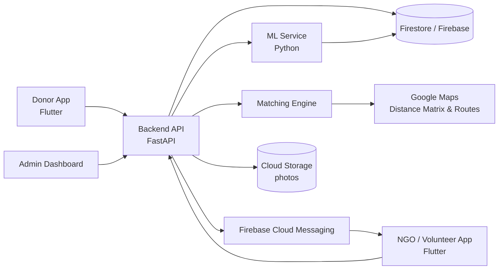

# 🍲 FoodLoop

> **"Don't let food go to waste when someone is going to bed hungry."**

**Logic League Ideathon · Theme: AI/ML** (Insights: *Personalization*, *AI Reliability*, *Small / Efficient AI*)

FoodLoop is a time-critical food-rescue platform that connects surplus cooked food from hostels, canteens, weddings and restaurants to verified NGOs and volunteers *before it spoils*, and uses AI to help donors prepare less surplus in the first place.

---

## 1. Problem Statement

**What is the problem?**
India produces large amounts of edible food that is thrown away every day, while millions of people go hungry. The gap is not only about quantity. It is about *time and coordination*.

**Who experiences it?**
- **Donors** (hostel messes, college canteens, restaurants, caterers, wedding venues) who have leftover food and no quick way to give it away.
- **NGOs and volunteers** who want to collect food but find out too late, or cannot reach it in time.
- **People in need** who never receive food that was perfectly good a few hours earlier.

**Why is it a problem?**
Cooked food has a spoilage window of only a few hours. Most donors don't know whom to contact, and most NGOs rely on phone calls and WhatsApp groups. By the time a match happens, the food is no longer safe to serve.

**What difficulties does it create?**
- Edible food ends up in landfills, producing methane.
- Donors hesitate because of fears about food-safety liability.
- NGOs waste fuel and volunteer time on failed or late pickups.
- Nobody learns *why* surplus occurs, so the same over-production repeats every day.

---

## 2. Existing Solutions

| Solution type | Examples | Limitation |
|---|---|---|
| Food-rescue apps and NGO networks | Robin Hood Army, Feeding India, various city-level apps | Many depend on manual coordination or are limited to specific cities; they are not designed around the spoilage clock. |
| WhatsApp / phone coordination | Informal volunteer groups | No matching logic, no tracking, no accountability, no safety record. |
| Generic delivery or logistics apps | Gig delivery platforms | Not built for donation, not NGO-aware, and not safety-aware. |
| Corporate CSR drives | Occasional events | One-off and not continuous. |

**The gap:** existing efforts mostly *redistribute* food after it is already surplus, and rarely treat the **spoilage deadline** as the main constraint in matching. Almost none help donors **prevent** surplus, and few provide a **verifiable trust and safety trail**.

*(Names above are illustrative; the team will verify current features of each before the final presentation.)*

---

## 3. Proposed Solution

FoodLoop is a mobile platform with four ideas working together:

1. **Fast listing.** A donor lists surplus food in about 30 seconds: photo, quantity, cooking time. The app computes a **"safe until" time**.
2. **Spoilage-aware matching.** The system ranks nearby verified NGOs and volunteers by *whether they can realistically arrive before the deadline*, not just by distance.
3. **Verified handover.** Pickup is tracked live, the handover is confirmed with a photo, and the donor receives an impact certificate.
4. **Prevention through prediction.** A forecasting model learns each donor's surplus pattern (for example, a canteen's weekday surplus) and recommends cooking quantities to cut waste at the source.

---

## 4. Key Features

- **30-second listing:** photo, quantity, cooking time and food type in one short flow.
- **Safe-until estimator:** rule-based window per food category (cooked rice, dry snacks, packed items) adjusted for time since cooking and storage; always conservative.
- **Urgency-based matching:** scores NGOs by travel time vs. remaining safe window, capacity, and past reliability.
- **Escalation engine:** if nobody accepts, the radius widens and alerts escalate; optional paid gig pickup as the last resort.
- **Live pickup tracking:** accepted, en route, picked up, delivered.
- **Food-safety layer:** hygiene checklist, timestamped photo, NGO right to reject, and logs for traceability.
- **Verified NGO network with trust ratings:** two-way ratings between donors and NGOs.
- **Surplus prediction:** per-donor forecasts and suggested quantities.
- **Impact dashboard:** meals saved and CO₂ avoided, with certificates for donors.

---

## 5. Technical Approach

### System architecture



### Major components

| Component | Responsibility |
|---|---|
| Donor app | Create listings, view status, certificates, forecasts |
| NGO / volunteer app | Receive alerts, accept, navigate, confirm handover |
| Backend API | Auth, listings, state machine, ratings, logs |
| Matching engine | Ranks candidates; handles escalation |
| ML service | Surplus forecasting; freshness-assist model |
| Admin dashboard | NGO verification, dispute handling, analytics |

### Data flow

1. Donor submits listing (photo, quantity, cook time, checklist) → API stores it and computes `safe_until`.
2. Matching engine finds candidates within a radius, then calls Maps for **real travel time**.
3. Candidates are scored and notified via push (FCM), best first, with a short acceptance timer.
4. One NGO accepts → listing locked → live status updates → handover photo → certificate generated.
5. Completed events feed the forecasting model's training data.

### Algorithms and methodologies

**Matching score (simplified):**

```
feasible  = travel_time + buffer  <  safe_until - now
score     = w1 * (1 / travel_time)
          + w2 * capacity_fit
          + w3 * trust_rating
          + w4 * acceptance_history
```
Only *feasible* candidates are scored; this is what makes matching spoilage-aware. Weights are tuned from pilot data.

**Safe-until estimator:** a transparent rule table (food category × storage condition) with conservative defaults. It is deliberately *rules, not ML*, so it is explainable and auditable.

**Surplus forecasting:** time-series models per donor using day-of-week, meal slot, events, and holidays. Start with a simple baseline (moving average / Prophet-style seasonality), then gradient-boosted models once data exists. Output: expected surplus and a suggested cooking quantity with a confidence range.

**Freshness assist (advisory only):** a lightweight image classifier flags visibly spoiled food (mold, discoloration) as a *warning*. It never certifies food as safe. A small, efficient model (e.g., MobileNet-class) can run on-device.

### APIs and external services
Google Maps (Distance Matrix, Directions), Firebase Auth, Firestore, Cloud Storage, Firebase Cloud Messaging.

### Infrastructure
Containerized backend (Docker) on a managed cloud service with autoscaling; Firebase for realtime data and push; a scheduled job for model retraining.

### Security and privacy considerations
- Phone/OTP authentication; NGOs verified manually (registration documents) before activation.
- Exact donor location revealed only to the accepting NGO.
- Role-based access, encrypted transport, and minimal personal data retention.
- Immutable event logs (listing → pickup → handover) for traceability and disputes.
- Rate limiting and abuse reporting to prevent fake listings.

### Food-safety and liability design
FoodLoop is a coordination layer, not a food certifier. It enforces a hygiene checklist, a conservative time window, and NGO right of refusal, and aligns with **FSSAI food-donation guidance**. Terms of use state responsibilities clearly. *(Legal wording to be reviewed with a professional before launch.)*

---

## 6. Technology Stack

| Layer | Technology |
|---|---|
| Frontend | Flutter (single codebase for Android/iOS) |
| Backend | FastAPI (Python), so API and ML share one language |
| Database / Realtime | Firebase Firestore |
| Auth & Notifications | Firebase Auth, Firebase Cloud Messaging |
| Storage | Firebase / Cloud Storage |
| ML | Python, scikit-learn, Prophet / LightGBM, PyTorch / TFLite for freshness-assist |
| Maps | Google Maps Platform |
| Infrastructure | Docker, managed cloud hosting, GitHub Actions CI |

---

## 7. Expected Impact

**Who benefits?**
- **Donors:** an easy, low-risk way to give, with certificates and reduced waste costs.
- **NGOs and volunteers:** timely alerts, fewer failed trips, reliable sources of food.
- **People in need:** more meals that are fresh and safe.
- **Environment and society:** less methane from landfills and a stronger culture of sharing.

**How it improves the situation:** shifts the process from manual, slow, and uncertain to **instant, tracked, and safety-aware**, while forecasting reduces waste before it exists.

**If successful:** a repeatable city-by-city model where every campus, canteen and venue has a one-tap path from "leftover" to "meal".

**How success is measured:** meals rescued; average time from listing to pickup; percentage of listings successfully collected; waste reduction at partner sites; NGO and donor retention.

**Sustainability:** free for donors and NGOs. Revenue from CSR sponsorships, a paid analytics dashboard for hotels and caterers, ESG reporting for companies, and sustainability grants.

---

## 8. Future Scope

- **Additional features:** packed-food and grocery surplus, scheduled recurring donations, multilingual voice listing.
- **Larger-scale deployment:** city-by-city rollout with local NGO partners; a hyperlocal start at one campus.
- **More users and use cases:** supermarkets, farms (produce), corporate cafeterias, community fridges.
- **Integrations:** hotel/POS and canteen management systems for automatic surplus data; delivery partners for backup pickups.
- **Technical improvements:** route batching for multi-stop pickups, better freshness models with sensor/temperature data, demand-side prediction for NGOs.

---

## Roadmap

| Phase | Goal |
|---|---|
| MVP | Listing, matching, accept, handover photo, basic dashboard |
| Campus pilot (1 month) | Hostels and canteens plus 2-3 local NGOs; measure meals saved and pickup time |
| Iterate | Add forecasting from pilot data; tune matching weights |
| Expand | More NGOs and venues; city launch |

## Known Challenges and Limitations
- **Last-mile logistics** and volunteer availability (mitigated by hyperlocal start and escalation).
- **Trust and liability:** a platform cannot guarantee safety, so process design, NGO refusal rights, and clear terms matter.
- **Cold start:** forecasting needs data; it begins with simple baselines.
- **AI limits:** image-based freshness checks are advisory and can be wrong.

### Team

**Team Name:** Deepminded

**Team Members:**
- Rohan Maddheshiya
- Lilesh Sahu
- Mohd Talib


